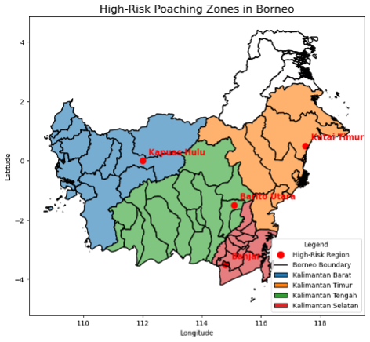
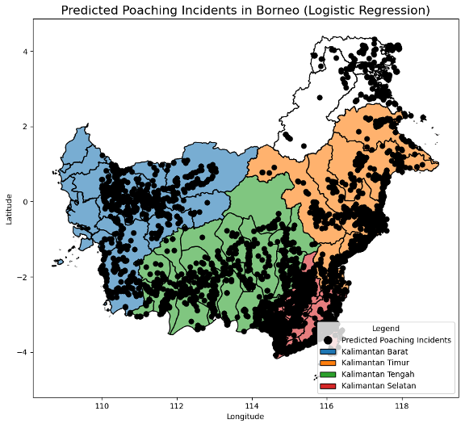
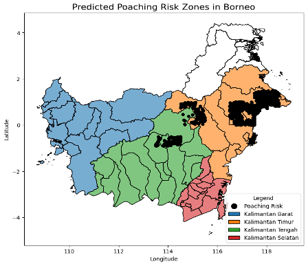

# poaching-risk-maps
Geospatial ML pipeline from my MSc dissertation: risk-mapping for orangutan poaching using forest-loss, access proxies (roads/settlements), and conservation context (protected areas).

## Results — Borneo Risk Maps

> Interpretation: darker/filled areas indicate **higher predicted poaching risk**. Maps are **relative risk surfaces**, not counts of confirmed incidents.

### Figure 1 — High-Risk Poaching Zones (overview)

*What to notice:* The overview highlights candidate high-risk regions against provincial boundaries to give geographic context for the predictions that follow.

### Figure 2 — Predicted Poaching Incidents (Logistic Regression)

*What to notice:* Black points mark locations predicted as incidents at a chosen decision threshold. Clusters tend to align with areas of greater access (roads/settlements) and recent forest-loss signals.

### Figure 3 — Predicted Poaching Risk Zones (Surface)

*What to notice:* Contiguous high-risk patches correspond to recent forest-loss clusters and access corridors, while lower-risk regions align with intact/protected forest.

#### How to read these maps
- **Scale:** higher intensity/filled area = higher *relative* risk (not absolute incident counts).
- **Inputs (example):** forest-loss history (GFW), distance to roads/settlements (OSM), protected-area buffers (WDPA).
- **Thresholding:** Figure 2 uses a logistic-regression threshold to display predicted incident points; Figure 3 shows a continuous risk surface.
- **Caveats:** labels are sparse; avoid spatial leakage by splitting train/test by region; access proxies are imperfect.